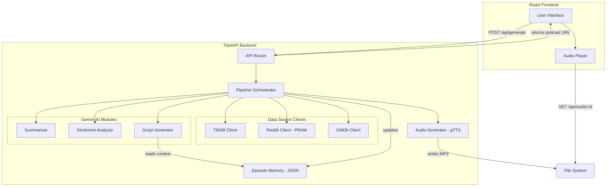

# Design Document: Film Review & News Podcast App

## Overview

The Film Review & News Podcast App is a full-stack web application that aggregates movie reviews from TMDB, Reddit (PRAW), and OMDb, processes them through Gemini API for summarization, sentiment analysis, and script generation, then produces a narrated podcast MP3 via TTS. The system is built as a React frontend with a FastAPI Python backend, targeting a working prototype achievable in 2–3 hours.

The pipeline flow is:

```
User Preferences → Metadata Retrieval → Review Aggregation → Summarization → Sentiment Analysis → Script Generation → Audio Generation → Podcast MP3
```

All AI processing (summarization, sentiment, script generation) uses the `google-genai` Python SDK with the Gemini API. Episode memory is persisted as JSON files on disk to maintain continuity across episodes.

### Key Design Decisions

1. **React + FastAPI**: React provides a responsive SPA frontend; FastAPI gives async Python backend with automatic OpenAPI docs.
2. **google-genai SDK**: All Gemini interactions go through the official SDK — no raw HTTP calls.
3. **JSON file persistence**: Episode memory and podcast metadata stored as JSON files in a `data/` directory. Simple, no database setup required.
4. **gTTS for TTS**: Quick MP3 generation without complex setup. Can be swapped for Google Cloud TTS later.
5. **Sequential pipeline**: Each stage feeds the next. Failures at any stage are caught, retried, and reported.

## Architecture



### Project Structure

```
film-podcast-app/
├── backend/
│   ├── main.py                  # FastAPI app entry point
│   ├── config.py                # Environment config, API keys
│   ├── pipeline.py              # Pipeline orchestrator
│   ├── clients/
│   │   ├── tmdb_client.py       # TMDB API client
│   │   ├── reddit_client.py     # Reddit/PRAW client
│   │   └── omdb_client.py       # OMDb API client
│   ├── ai/
│   │   ├── gemini_client.py     # Shared Gemini SDK setup
│   │   ├── summarizer.py        # Summarization module
│   │   ├── sentiment.py         # Sentiment analysis module
│   │   └── script_generator.py  # Script generation module
│   ├── audio/
│   │   └── tts.py               # gTTS audio generation
│   ├── memory/
│   │   └── episode_memory.py    # JSON-based episode memory
│   ├── models.py                # Pydantic data models
│   └── requirements.txt         # Python dependencies
├── frontend/
│   ├── package.json
│   ├── src/
│   │   ├── App.jsx              # Main app component
│   │   ├── components/
│   │   │   ├── PreferenceForm.jsx
│   │   │   ├── ProgressIndicator.jsx
│   │   │   └── PodcastPlayer.jsx
│   │   └── api.js               # Backend API client
│   └── public/
├── data/
│   ├── episodes/                # Generated MP3 files
│   └── memory.json              # Episode memory store
└── .env                         # API keys
```

## Components and Interfaces

### 1. FastAPI Router (`backend/main.py`)

Exposes the REST API consumed by the React frontend.

**Endpoints:**

| Method | Path | Description |
|--------|------|-------------|
| `POST` | `/api/generate` | Accepts user preferences, triggers pipeline, returns podcast ID |
| `GET` | `/api/status/{podcast_id}` | Returns pipeline progress/status |
| `GET` | `/api/audio/{podcast_id}` | Serves the generated MP3 file |
| `GET` | `/api/episodes` | Returns list of past episodes |
| `GET` | `/api/genres` | Returns available genre list from TMDB |

### 2. Pipeline Orchestrator (`backend/pipeline.py`)

Coordinates the end-to-end generation flow. Runs each stage sequentially, captures timing, handles retries and error propagation.

```python
class PipelineOrchestrator:
    async def run(self, preferences: UserPreferences) -> PodcastResult:
        """Execute full pipeline: fetch → summarize → sentiment → script → audio"""
    
    async def _fetch_metadata(self, movie_titles: list[str]) -> list[MovieRecord]:
        """Fetch and merge metadata from TMDB + OMDb"""
    
    async def _aggregate_reviews(self, movies: list[MovieRecord]) -> list[AggregatedReviews]:
        """Collect reviews from Reddit for each movie"""
    
    async def _summarize(self, reviews: list[AggregatedReviews]) -> list[MovieSummary]:
        """Summarize reviews via Gemini"""
    
    async def _analyze_sentiment(self, reviews: list[AggregatedReviews]) -> list[SentimentResult]:
        """Analyze sentiment via Gemini"""
    
    async def _generate_script(self, summaries, sentiments, memory_context) -> NarrationScript:
        """Generate podcast script via Gemini"""
    
    async def _generate_audio(self, script: NarrationScript) -> str:
        """Convert script to MP3, return file path"""
```

### 3. Data Source Clients

#### TMDB Client (`backend/clients/tmdb_client.py`)

```python
class TMDBClient:
    async def search_movie(self, title: str) -> TMDBMovie | None
    async def get_movie_details(self, movie_id: int) -> TMDBMovie
    async def get_trending(self) -> list[TMDBMovie]
    async def get_genres(self) -> list[Genre]
```

Uses `httpx` for async HTTP. Reads `TMDB_API_KEY` from env.

#### Reddit Client (`backend/clients/reddit_client.py`)

```python
class RedditClient:
    def search_reviews(self, movie_title: str, subreddits: list[str] = None) -> list[RedditReview]
```

Uses PRAW (synchronous). Searches `r/movies`, `r/MovieReviews`, `r/flicks`. Returns 3–10 top-level comments per movie. Implements retry with exponential backoff (up to 3 retries).

#### OMDb Client (`backend/clients/omdb_client.py`)

```python
class OMDbClient:
    async def get_movie(self, title: str) -> OMDbMovie | None
```

Uses `httpx`. Reads `OMDB_API_KEY` from env.

### 4. Gemini AI Modules

All modules share a common Gemini client setup:

#### Gemini Client (`backend/ai/gemini_client.py`)

```python
from google import genai

def get_gemini_client() -> genai.Client:
    """Initialize and return a configured Gemini client from .env API key"""
```

#### Summarizer (`backend/ai/summarizer.py`)

```python
class Summarizer:
    async def summarize(self, reviews: AggregatedReviews) -> MovieSummary:
        """Generate 200-500 word summary with source attribution. Retries up to 2x."""
```

- Temperature: 0.3 (factual, concise)
- Prompt includes source attribution instructions

#### Sentiment Analyzer (`backend/ai/sentiment.py`)

```python
class SentimentAnalyzer:
    async def analyze(self, reviews: AggregatedReviews) -> SentimentResult:
        """Classify sentiment, extract highlights, assign confidence. Retries up to 2x."""
```

- Temperature: 0.2 (analytical)
- Returns structured JSON with sentiment, highlights, confidence score

#### Script Generator (`backend/ai/script_generator.py`)

```python
class ScriptGenerator:
    async def generate(
        self, summaries: list[MovieSummary], sentiments: list[SentimentResult],
        episode_context: EpisodeContext | None
    ) -> NarrationScript:
        """Generate 1500-3000 word narration script with episode continuity. Retries up to 2x."""
```

- Temperature: 0.7 (creative, conversational)
- Prompt includes episode memory context for continuity references
- Output includes speaker cues and paragraph breaks

### 5. Audio Generator (`backend/audio/tts.py`)

```python
class AudioGenerator:
    def generate(self, script: NarrationScript) -> str:
        """Convert script to MP3 using gTTS. Returns file path. Retries up to 2x."""
    
    def _insert_pauses(self, text: str) -> str:
        """Process speaker cues/paragraph breaks into pause markers"""
```

Uses `gTTS` library. Splits script at paragraph breaks to insert natural pauses. Outputs MP3 to `data/episodes/`.

### 6. Episode Memory (`backend/memory/episode_memory.py`)

```python
class EpisodeMemory:
    def __init__(self, memory_path: str = "data/memory.json"):
        """Load or initialize memory from JSON file"""
    
    def get_context(self, last_n: int = 5) -> EpisodeContext | None:
        """Return context summary of last N episodes, or None if first episode"""
    
    def save_episode(self, episode: EpisodeSummary) -> None:
        """Append episode summary to memory and persist to disk"""
    
    def get_recurring_topics(self) -> dict:
        """Return franchises/directors mentioned across episodes"""
```

JSON structure stores a list of episode summaries with movies covered, topics, and dates.

### 7. React Frontend Components

#### PreferenceForm
- Genre multi-select dropdown (populated from `/api/genres`)
- Movie title search input with autocomplete
- "Trending Films" toggle
- Submit button triggers `/api/generate`

#### ProgressIndicator
- Polls `/api/status/{id}` every 2 seconds
- Shows current pipeline stage and elapsed time

#### PodcastPlayer
- HTML5 audio player for the generated MP3
- Download link
- Episode metadata display (title, movies covered, duration)

## Data Models

All data models use Pydantic for validation and serialization.

```python
from pydantic import BaseModel, Field
from enum import Enum
from datetime import datetime

# --- Enums ---

class SentimentPolarity(str, Enum):
    POSITIVE = "positive"
    NEGATIVE = "negative"
    MIXED = "mixed"

class PipelineStage(str, Enum):
    METADATA = "metadata"
    REVIEWS = "reviews"
    SUMMARIZATION = "summarization"
    SENTIMENT = "sentiment"
    SCRIPT = "script"
    AUDIO = "audio"
    COMPLETE = "complete"
    FAILED = "failed"

# --- Request/Response ---

class UserPreferences(BaseModel):
    genres: list[str] = []
    movie_titles: list[str] = []
    include_trending: bool = False

class Genre(BaseModel):
    id: int
    name: str

# --- Movie Data ---

class TMDBMovie(BaseModel):
    id: int
    title: str
    release_date: str | None = None
    genres: list[str] = []
    director: str | None = None
    cast: list[str] = []
    rating: float | None = None
    overview: str | None = None

class OMDbMovie(BaseModel):
    title: str
    imdb_rating: str | None = None
    rotten_tomatoes: str | None = None
    plot: str | None = None
    year: str | None = None

class MovieRecord(BaseModel):
    """Unified movie record merged from TMDB + OMDb"""
    title: str
    release_date: str | None = None
    genres: list[str] = []
    director: str | None = None
    cast: list[str] = []
    tmdb_rating: float | None = None
    imdb_rating: str | None = None
    rotten_tomatoes: str | None = None
    plot: str | None = None

# --- Reviews ---

class RedditReview(BaseModel):
    text: str
    score: int
    author: str
    subreddit: str

class AggregatedReviews(BaseModel):
    movie: MovieRecord
    reddit_reviews: list[RedditReview] = []
    source_count: int = 0

# --- AI Outputs ---

class MovieSummary(BaseModel):
    movie_title: str
    summary: str
    word_count: int
    source_attributions: list[str] = []
    limited_coverage: bool = False

class SentimentHighlight(BaseModel):
    text: str
    polarity: SentimentPolarity
    source: str | None = None

class SentimentResult(BaseModel):
    movie_title: str
    overall_sentiment: SentimentPolarity
    confidence: float = Field(ge=0.0, le=1.0)
    highlights: list[SentimentHighlight] = []
    disagreements: list[str] = []

class NarrationScript(BaseModel):
    text: str
    word_count: int
    movie_segments: list[str] = []

# --- Audio ---

class PodcastResult(BaseModel):
    podcast_id: str
    title: str
    file_path: str
    duration_seconds: float | None = None
    movies_covered: list[str] = []
    created_at: datetime

# --- Pipeline Status ---

class PipelineStatus(BaseModel):
    podcast_id: str
    stage: PipelineStage
    progress_pct: int = 0
    error: str | None = None
    stage_timings: dict[str, float] = {}

# --- Episode Memory ---

class EpisodeSummary(BaseModel):
    episode_id: str
    title: str
    date: datetime
    movies_covered: list[str] = []
    directors_mentioned: list[str] = []
    franchises_mentioned: list[str] = []
    key_topics: list[str] = []
    summary: str

class EpisodeContext(BaseModel):
    recent_episodes: list[EpisodeSummary] = []
    recurring_directors: list[str] = []
    recurring_franchises: list[str] = []
    is_first_episode: bool = False
```

### JSON Memory File Format (`data/memory.json`)

```json
{
  "episodes": [
    {
      "episode_id": "ep-20240101-abc123",
      "title": "Episode 1: New Year Cinema Roundup",
      "date": "2024-01-01T12:00:00Z",
      "movies_covered": ["Oppenheimer", "Barbie"],
      "directors_mentioned": ["Christopher Nolan", "Greta Gerwig"],
      "franchises_mentioned": ["Barbie"],
      "key_topics": ["summer blockbusters", "box office records"],
      "summary": "Covered the Barbenheimer phenomenon..."
    }
  ]
}
```


## Correctness Properties

*A property is a characteristic or behavior that should hold true across all valid executions of a system — essentially, a formal statement about what the system should do. Properties serve as the bridge between human-readable specifications and machine-verifiable correctness guarantees.*

### Property 1: TMDB Client parses all required metadata fields

*For any* valid TMDB API JSON response containing movie data, the `TMDBClient` should produce a `TMDBMovie` object where title, release_date, genres, director, cast, and rating are correctly extracted from the response.

**Validates: Requirements 1.1**

### Property 2: OMDb Client parses ratings and plot

*For any* valid OMDb API JSON response, the `OMDbClient` should produce an `OMDbMovie` object where imdb_rating, rotten_tomatoes, and plot are correctly extracted from the response.

**Validates: Requirements 1.2**

### Property 3: Graceful degradation on data source failure

*For any* subset of data source failures (TMDB, OMDb, Reddit), the `Review_Aggregator` should still produce a result containing data from the remaining available sources, and should never raise an unhandled exception.

**Validates: Requirements 1.3, 1.4, 2.4**

### Property 4: Metadata merge prefers TMDB on conflict

*For any* pair of `TMDBMovie` and `OMDbMovie` with overlapping fields (e.g., title, plot), the merged `MovieRecord` should use the TMDB value for any field where both sources provide data.

**Validates: Requirements 1.5**

### Property 5: Reddit review count bounds

*For any* Reddit API response containing N top-level comments (where N >= 3), the `RedditClient` should return between 3 and 10 `RedditReview` objects inclusive.

**Validates: Requirements 2.2**

### Property 6: Reddit review fields are populated

*For any* `RedditReview` returned by the `RedditClient`, the `text`, `score`, `author`, and `subreddit` fields should all be non-empty/non-null.

**Validates: Requirements 2.5**

### Property 7: Service retry behavior

*For any* service call (Reddit, Gemini Summarizer, Gemini Sentiment, Gemini Script, TTS) that encounters transient errors, the caller should retry up to the configured maximum (Reddit: 3, Gemini modules: 2, TTS: 2) before returning an error status. The total number of attempts should equal max_retries + 1.

**Validates: Requirements 2.3, 3.4, 4.5, 6.4**

### Property 8: Summary word count within bounds

*For any* `MovieSummary` produced by the `Summarizer`, the `word_count` should be between 200 and 500 inclusive.

**Validates: Requirements 3.2**

### Property 9: Limited coverage flag for sparse reviews

*For any* input to the `Summarizer` where the number of reviews is fewer than 3, the resulting `MovieSummary` should have `limited_coverage` set to `True`.

**Validates: Requirements 3.3**

### Property 10: Summary preserves source attribution

*For any* `MovieSummary` produced from an `AggregatedReviews` input, the `source_attributions` list should contain at least one entry corresponding to each source type (TMDB, Reddit, OMDb) that contributed data to the input.

**Validates: Requirements 3.5**

### Property 11: SentimentResult structural invariants

*For any* `SentimentResult` produced by the `Sentiment_Analyzer`: (a) `overall_sentiment` must be one of "positive", "negative", or "mixed"; (b) `confidence` must be between 0.0 and 1.0 inclusive; (c) `highlights` must contain at most 5 entries; and (d) each highlight must have a non-empty `text` and a valid `polarity`.

**Validates: Requirements 4.1, 4.2, 4.4**

### Property 12: Script structure contains required segments

*For any* `NarrationScript` produced by the `Script_Generator` given N movies (N >= 1), the script text should contain an identifiable introduction section, N per-movie segments, and a closing section.

**Validates: Requirements 5.1**

### Property 13: Script word count within bounds

*For any* `NarrationScript` produced by the `Script_Generator`, the `word_count` should be between 1,500 and 3,000 inclusive.

**Validates: Requirements 5.2**

### Property 14: Script contains TTS formatting markers

*For any* `NarrationScript` produced by the `Script_Generator`, the script text should contain paragraph breaks (double newlines) and at least one speaker cue marker suitable for TTS processing.

**Validates: Requirements 5.5**

### Property 15: Audio generator produces valid MP3

*For any* valid `NarrationScript` input, the `Audio_Generator` should produce a file at the returned path that exists and has a non-zero file size with MP3 content.

**Validates: Requirements 6.1**

### Property 16: Audio speaking pace within bounds

*For any* generated podcast audio, the ratio of script word count to audio duration (in minutes) should be between 130 and 160 words per minute.

**Validates: Requirements 6.2**

### Property 17: Audio duration within bounds

*For any* generated podcast audio file, the duration should be between 10 and 20 minutes (600–1200 seconds).

**Validates: Requirements 6.3**

### Property 18: User preferences round-trip to backend

*For any* valid `UserPreferences` object (with any combination of genres, movie_titles, and include_trending), serializing it to JSON and sending it to the `/api/generate` endpoint should result in the backend receiving an equivalent `UserPreferences` object.

**Validates: Requirements 7.4**

### Property 19: Episode memory returns at most N recent episodes

*For any* `EpisodeMemory` containing M episode summaries, calling `get_context(last_n=5)` should return an `EpisodeContext` with at most `min(M, 5)` recent episodes, ordered from most recent to oldest.

**Validates: Requirements 8.1**

### Property 20: Recurring topics tracking

*For any* sequence of saved episodes where a director or franchise appears in 2 or more episodes, `get_recurring_topics()` should include that director or franchise in its result.

**Validates: Requirements 8.2**

### Property 21: Episode memory persistence round-trip

*For any* `EpisodeSummary`, saving it via `save_episode()` and then reloading the `EpisodeMemory` from the same JSON file should produce a memory state that contains the saved episode with all fields preserved.

**Validates: Requirements 8.4**

### Property 22: Pipeline failure reports stage and reason

*For any* pipeline execution where a stage fails after exhausting retries, the returned `PipelineStatus` should have `stage` set to the failing stage's enum value and `error` set to a non-empty string describing the failure.

**Validates: Requirements 9.3**

### Property 23: Successful pipeline output completeness

*For any* successful pipeline execution, the `PodcastResult` should have non-empty `podcast_id`, `title`, `file_path`, and `movies_covered`, and the `PipelineStatus.stage_timings` should contain a positive timing entry for each completed stage.

**Validates: Requirements 9.4, 9.5**

### Property 24: Gemini API rate limiting

*For any* sequence of N Gemini API calls made in rapid succession, the rate limiter should ensure that the total elapsed time is at least `(N - 1) * min_interval` seconds, preventing quota exhaustion.

**Validates: Requirements 10.5**

## Error Handling

### Error Handling Strategy

The app uses a layered error handling approach: each module handles its own retries and reports structured errors upward to the pipeline orchestrator, which aggregates them for the user.

### Data Source Errors

| Source | Error Type | Handling |
|--------|-----------|----------|
| TMDB API | HTTP error / timeout | Log error, return `None`. Aggregator continues with OMDb + Reddit. |
| OMDb API | HTTP error / timeout | Log error, return `None`. Aggregator continues with TMDB + Reddit. |
| Reddit API | PRAW exception / rate limit | Retry up to 3 times with exponential backoff (1s, 2s, 4s). After exhaustion, log and continue without Reddit data. |

### Gemini API Errors

| Module | Error Type | Handling |
|--------|-----------|----------|
| Summarizer | API error / timeout | Retry up to 2 times. On failure, return error status with stage="summarization". |
| Sentiment Analyzer | API error / timeout | Retry up to 2 times. On failure, return error status with stage="sentiment". |
| Script Generator | API error / timeout | Retry up to 2 times. On failure, return error status with stage="script". |
| All modules | Invalid/missing API key | Halt immediately with clear error message. No retries. |
| All modules | Rate limit exceeded | Rate limiter queues requests. If quota fully exhausted, return error with explanation. |

### TTS Errors

| Module | Error Type | Handling |
|--------|-----------|----------|
| Audio Generator | gTTS error / network failure | Retry up to 2 times. On failure, return error status with stage="audio". |
| Audio Generator | File system write error | Return error immediately. No retry (likely a permissions issue). |

### Pipeline-Level Error Handling

- Each stage catches its own exceptions and returns a structured error or `None`.
- The `PipelineOrchestrator` checks each stage result before proceeding to the next.
- If a critical stage fails (summarization, script generation, audio), the pipeline halts and returns a `PipelineStatus` with `stage=FAILED`, the failing stage name, and the error message.
- If a non-critical source fails (one of TMDB/OMDb/Reddit), the pipeline continues with reduced data.
- All errors are logged with timestamps and stage context for debugging.

### Frontend Error Display

- The `ProgressIndicator` component detects `FAILED` status from polling and displays the error message.
- Error messages are user-friendly: e.g., "Script generation failed — please try again" rather than raw stack traces.
- A "Retry" button allows the user to re-trigger the pipeline with the same preferences.

### Episode Memory Errors

- If `memory.json` is corrupted or unreadable, `EpisodeMemory` initializes with an empty state and logs a warning.
- If writing to `memory.json` fails, the episode still completes but memory is not updated. The error is logged.

## Testing Strategy

### Dual Testing Approach

The app uses both unit tests and property-based tests for comprehensive coverage:

- **Unit tests** verify specific examples, edge cases, integration points, and error conditions.
- **Property-based tests** verify universal properties across randomly generated inputs using the `hypothesis` library.

Both are complementary: unit tests catch concrete bugs at known boundaries, property tests verify general correctness across the input space.

### Property-Based Testing Configuration

- **Library**: [Hypothesis](https://hypothesis.readthedocs.io/) for Python
- **Minimum iterations**: 100 per property test (via `@settings(max_examples=100)`)
- **Tag format**: Each property test includes a comment referencing the design property:
  ```python
  # Feature: film-podcast-app, Property 4: Metadata merge prefers TMDB on conflict
  ```
- **Each correctness property maps to exactly one property-based test function.**

### Test Organization

```
backend/
├── tests/
│   ├── unit/
│   │   ├── test_tmdb_client.py
│   │   ├── test_reddit_client.py
│   │   ├── test_omdb_client.py
│   │   ├── test_summarizer.py
│   │   ├── test_sentiment.py
│   │   ├── test_script_generator.py
│   │   ├── test_audio_generator.py
│   │   ├── test_episode_memory.py
│   │   └── test_pipeline.py
│   ├── property/
│   │   ├── test_prop_clients.py        # Properties 1-6
│   │   ├── test_prop_retry.py          # Property 7
│   │   ├── test_prop_summarizer.py     # Properties 8-10
│   │   ├── test_prop_sentiment.py      # Property 11
│   │   ├── test_prop_script.py         # Properties 12-14
│   │   ├── test_prop_audio.py          # Properties 15-17
│   │   ├── test_prop_preferences.py    # Property 18
│   │   ├── test_prop_memory.py         # Properties 19-21
│   │   ├── test_prop_pipeline.py       # Properties 22-23
│   │   └── test_prop_rate_limit.py     # Property 24
│   └── conftest.py                     # Shared fixtures, Hypothesis strategies
frontend/
├── src/
│   └── __tests__/
│       ├── PreferenceForm.test.jsx
│       ├── ProgressIndicator.test.jsx
│       └── PodcastPlayer.test.jsx
```

### Unit Test Coverage

Unit tests focus on:

- **Specific examples**: Known movie titles, known API responses, expected outputs.
- **Edge cases**: Empty inputs, missing API keys (10.4), first episode with no memory (8.5), fewer than 3 Reddit results, corrupted memory.json.
- **Integration points**: Frontend components render correctly (7.1, 7.2, 7.3, 7.5, 7.6), pipeline stages execute in order (9.1), API key loaded from env (10.2), Gemini model parameters configured per task (10.3).
- **Error conditions**: API unavailability, invalid responses, file system errors.

### Property Test Coverage

Each of the 24 correctness properties maps to one Hypothesis test. Key strategies:

| Property Group | Hypothesis Strategy |
|---------------|-------------------|
| API response parsing (1-2) | Generate random JSON dicts with movie fields |
| Graceful degradation (3) | Generate random subsets of source failures |
| Metadata merge (4) | Generate random TMDBMovie + OMDbMovie pairs with overlapping fields |
| Reddit bounds (5-6) | Generate random lists of comments of varying lengths |
| Retry behavior (7) | Generate random sequences of success/failure responses |
| Summary constraints (8-10) | Generate random AggregatedReviews with varying review counts and sources |
| Sentiment structure (11) | Generate random SentimentResult objects and validate invariants |
| Script structure (12-14) | Generate random summary + sentiment inputs, validate output structure |
| Audio output (15-17) | Generate random scripts, validate file output and duration ratios |
| Preferences round-trip (18) | Generate random UserPreferences via Hypothesis |
| Episode memory (19-21) | Generate random episode sequences, test retrieval and persistence |
| Pipeline output (22-23) | Generate random pipeline scenarios with injected failures |
| Rate limiting (24) | Generate random call sequences and measure timing |

### Frontend Testing

- **Framework**: React Testing Library + Jest
- **Focus**: Component rendering, user interactions, API call structure
- Tests verify that UI components from Requirement 7 render correctly and pass preferences to the backend.

### Running Tests

```bash
# Backend unit tests
pytest backend/tests/unit/ -v

# Backend property tests (100 examples each)
pytest backend/tests/property/ -v --hypothesis-show-statistics

# Frontend tests
cd frontend && npm test -- --run

# All backend tests
pytest backend/tests/ -v
```
